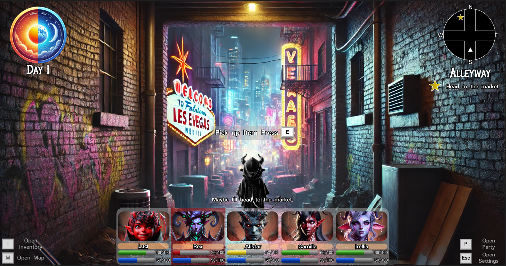
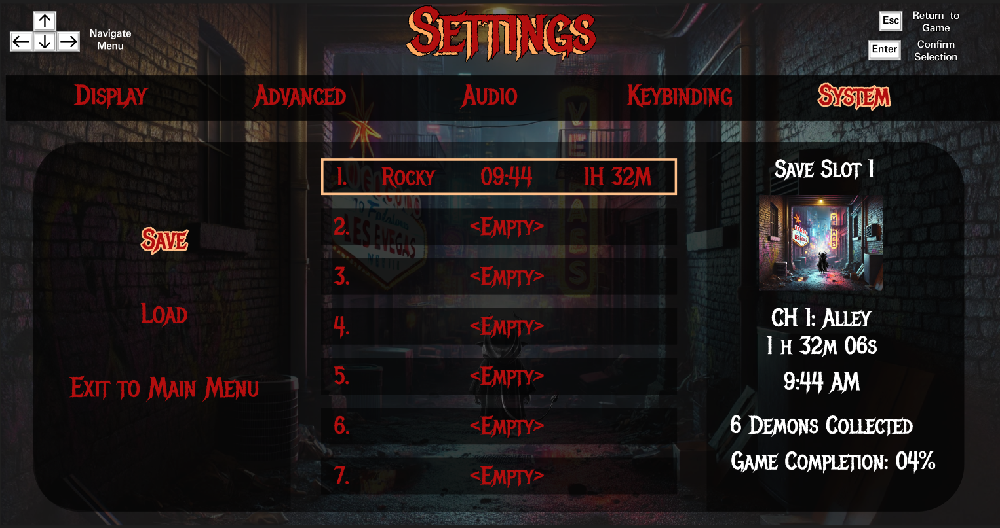

# Roxythe (Rocky) Harding's Portfolio
Welcome to my portfolio repository! Here, you’ll find an overview of my skills, projects, and achievements as I pursue a career in game development and software engineering.

## About Me
Over the years, I’ve gained experience in various industries while pursuing education to refine my skills. From earning commendations in the U.S. Air Force to developing maps in Unreal Engine, I’m committed to excelling in my field.
[Read More](./About_Me.md)

## Featured Projects
- [Arcane Invaders](https://github.com/Roxythe/ArcaneInvaders): A class project I made with two other schoolmates for an assignment. The game is a reskin of space invaders with 3D models. The project was written in C++ via MSCV and uses Vulkan Rendering API.
- [Random Level Generator](https://github.com/Roxythe/RandomLevelGenerator): An independent project I made to practice using SFML library and learning to make my code more modular in C++.
- [Game of Life](https://github.com/Roxythe/GameOfLife): A simulation of Conway's Game of Life, showcasing algorithm implementation in C++.
- [Calculator App](https://github.com/Roxythe/Calculator_App): A basic calculator application using wxWidgets in C++.
- [Bullet Typhoon Game Prototype](https://github.com/Bucsfanga/BulletTyphoon): Repository link for a First Person Shooter game made with Unity. *Still in development*

## Media
- [Arcane Invaders Demo](https://youtu.be/6Tyz5VY1B9U): A short demo of my game Arcane Invaders, a reskin of the classic Space Invaders.
- [Map 1 Demo](https://youtu.be/VP0z5PM8efk): A short demo of a level created in Unreal Engine.
- [Map 2 Demo](https://youtu.be/GQODAAfSKQY): Another Unreal Engine map showcasing my level design skills.
- [Calculator App Demo](https://youtube.com/shorts/52UYw7cDynw?feature=share): Short showcase demo of my calculator app.
- [Game of Life App Demo](https://youtube.com/shorts/NMT-eRCL6Uo?feature=share): Short showcase demo of my Game of Life app.
- [Random Level Generator App Demo](https://youtu.be/iyXms6ZvKIk): Short showcase demo of my Random Level Generator app.

## Creative Works

### Game Pitch
- **[Sinful](https://drive.google.com/file/d/1vynmTaQE3kLal942TclcBb1cu3SBnk-d/view?usp=sharing)**: A game pitch I crafted demonstrating my creativity and flexible skillset.
As one of my class assignments I was asked to creat a pitch and proposal for a new game. *Sinful* is a fantasy RPG with roguelite mechanics and a turn-based combat system. The story centers around a fledling demon with dreams of becoming the next overlord of sin. The games targeted demographic is gamers 13-28 who enjoy challenging gameplay where choices throughout the game have a dramatic impact on the storyline. Mid-Fidelity protoype screens made with Figma.
 

### Childrens Book
- **[A Vibrant Life](https://drive.google.com/file/d/1iqhhlrDHMhrJuUQo3DLyqb9Sb14Js99V/view?usp=sharing)**: A delightful story for young readers, showcasing my creativity and storytelling skills.
As part of my creative pursuits, I wrote a children's book titled *A Vibrant Life*. The story focuses on the grief of loss and to appreciate the precious things that you have. It is designed for readers aged 5-12. This project reflects my ability to create engaging, imaginative content for younger audiences.

## Contact
- [LinkedIn](https://www.linkedin.com/in/roxythe-harding/)
- [Email](mailto:roxythelharding@gmail.com)

# Technical Skills

## Programming Languages
- C++

## Game Development
- Unreal Engine (self-taught)
- Level Design
- Visual Scripting

## Tools
- Git and GitHub
- Visual Studio
- wxWidgets
- SFML

## Soft Skills
- Leadership and teamwork
- Communication
- Adaptability

